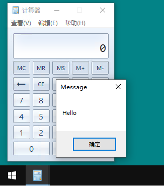

# GhostWriting

鬼写注入的x64版本，具体原理参考原项目：https://github.com/c0de90e7/GhostWriting

# 原理简述

一、通过 GetShellWindow() + GetWindowThreadProcessId() + OpenThread() 获得 explorer.exe 的主线程句柄

二、在NTDLL模块中寻找“自跳地址”，即 `jmp $`，当CPU执行到这条地址的时候，就会进入无限循环状态（可以锁死线程，避免RIP乱跑，保护寄存器、栈的数值）

三、在NTDLL模块中寻找满足类似如下条件的gadgets代码（可有可无的指令主要是为了增加搜索成功的概率）

```
MOV [RDI+0x10], RSI   # 必须存在，位移值可以是0，且两边的寄存器都必须是非易蒸发的
XOR RAX, RAX   # 可有可无
POP RBX        # 可有可无
ADD RSP, 0x20  # 可有可无
RET   # 必须存在
```

四、在完成上述工作后，具备了向 explorer.exe 主线程的栈中写入任意数据、调用任意API的能力（通过 `SetThreadContext` 函数）

五、以上面提供的gadgets代码为例，写入数据：

```
1. 将所需写入的数据放在RSI中，写入的地址写入RDI中（注意地址要减掉位移）
2. 栈顶指向自跳地址 <-- 这一步很重要
3. EIP指向gadgets代码
4. 执行gadgets代码时，数据会被写入目标地址
5. 执行到RET指令时，RIP将会回到自跳地址，进入死循环（相当于线程被暂停了，此时寄存器和栈空间数据不会被修改）
6. 可以重复上述过程继续往栈空间写入数据
```

六、以上面提供的gadgets代码为例，调用API：

```
1. 通过第五点的写入数据过程，将API的参数、以及返回地址按顺序排布在栈顶位置（注意fastcall调用约定还需要把前四个参数赋值到寄存器中），其中返回地址设置为自跳地址，此时栈内存的分布大致如下：

自跳地址 <-- 栈顶
参数A   <-- RCX同样储存一份
参数B   <-- RDX同样储存一份
参数C   <-- R8同样储存一份
参数D   <-- R9同样储存一份
参数E
...
栈内其他数据

2. RIP进入API地址时，由于没有使用CALL指令，因此上一步需要我们手动将栈顶设置为自跳地址
3. API执行完毕后，返回时就会回到自跳地址，进入死循环
```

# Shellcode注入流程

1. 获得 explorer.exe 的主线程句柄，然后暂停线程，并保存线程上下文，便于恢复线程
2. 通过计算评估需要的栈空间大小，并将RSP抬高，避免破坏原有栈数据（抬高RSP相当于C语言中的申请内存）
3. 通过gadgets代码在栈中部署 `NtProtectVirtualMemory` 函数的参数以及返回地址
4. RIP指向 `NtProtectVirtualMemory` 函数进行调用，目的是将刚才抬高的栈空间设置为可执行权限
5. 通过gadgets代码循环写入Shellcode到栈空间
6. 控制RSP指向自跳地址，RIP指向Shellcode入口，执行Shellcode
7. Shellcode执行完毕后返回自跳地址，此时暂停线程，还原线程上下文，然后继续运行线程

# 运行效果

这里注入的对象是计算器



